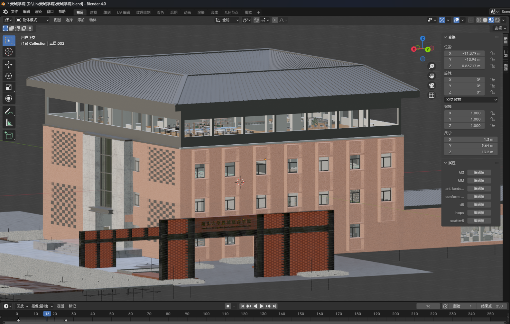
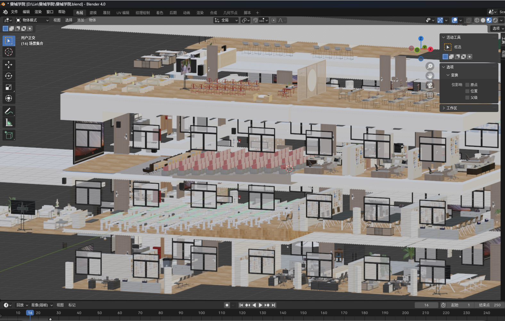
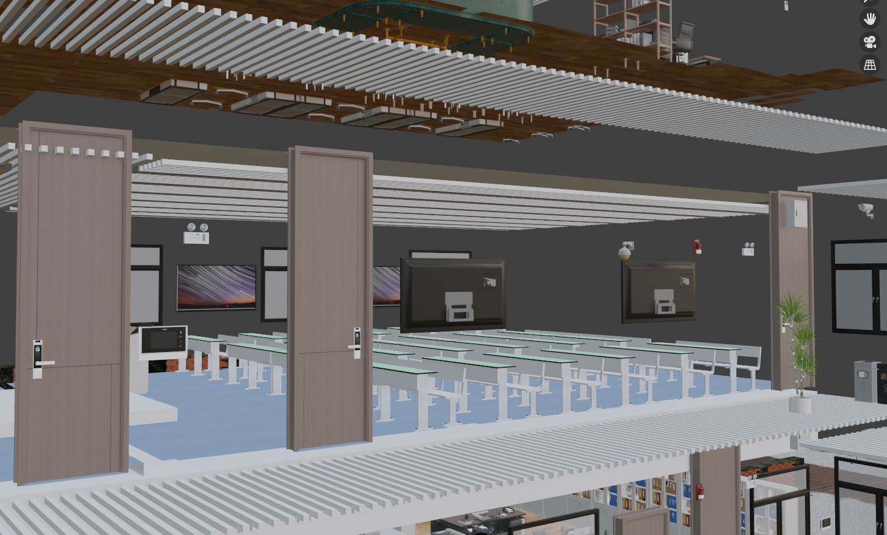
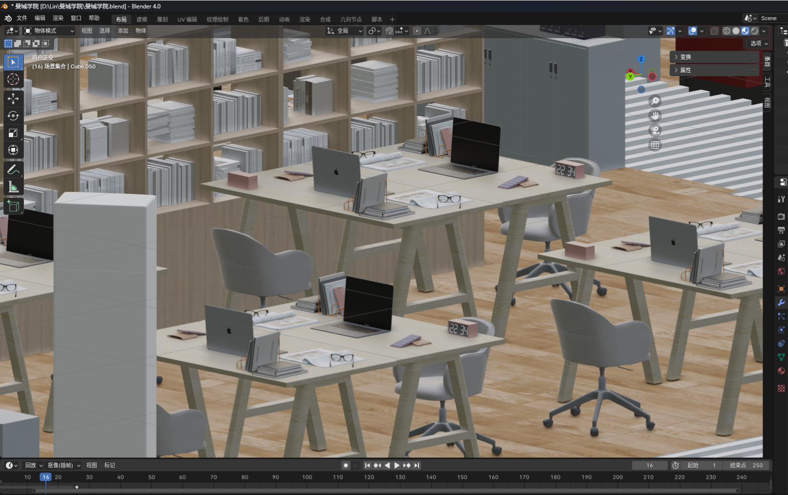
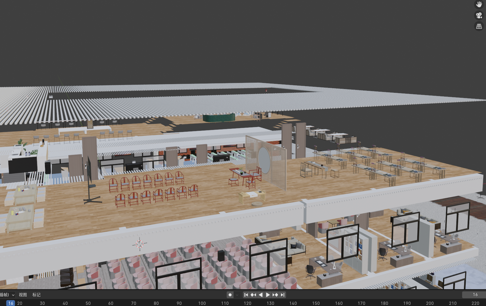
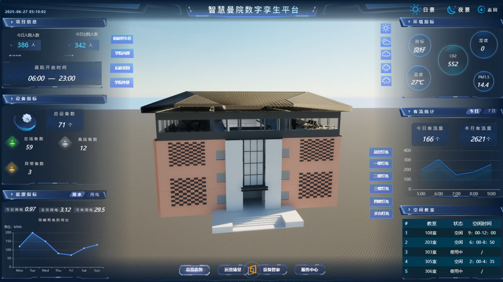

# 曼城学院三维模型资产

**WisdomScape MMJI · 湖北大学曼城联合学院教学楼数字模型**

这里保存了曼城学院教学楼的 Blender 工程、OBJ/MTL 和 FBX 模型，覆盖建筑外观、楼层结构及室内空间。项目源自 2025 年 6 月夏令营的 **WisdomScape MMJI** 校园数字孪生项目，为建筑展示、场景开发和后续数字孪生应用提供模型基础。



[下载全部模型](https://github.com/Calix-L/manchester-institute-assets/releases/tag/assets-2026-09-13) · [下载与还原](#下载与还原) · [文件清单](#文件清单) · [图片来源](docs/image-sources.md)

## 模型预览

模型包含教学楼外立面、屋顶、门窗、楼层与室内布置。下图展示楼层剖视、教室、办公学习空间和上层活动空间，均取自项目汇报中的原始建模截图。

| 楼层与室内结构 | 教室空间 |
| --- | --- |
|  |  |
| **办公与学习空间** | **上层活动空间** |
|  |  |

## 项目背景

根据《林振昕 夏令营结束汇报》（2025 年 6 月），团队结合实地观察与建筑设计图纸，在两周内手工完成学院教学楼建模，按 1:1 比例复现建筑空间。汇报将这些模型作为校园数字孪生系统的三维资产，并提出 AR/VR 体验、游戏场景、短剧制作和建设模拟等后续使用方向。

WisdomScape MMJI 项目还涵盖数据中枢、物联网平台和边缘智能应用。本仓库归档其中的**三维模型资产**。下面的系统截图展示模型在项目中的应用背景，相关平台源码、服务和实时数据不在本仓库内。



*图中界面与指标为当时的汇报展示内容。项目背景见汇报第 3、5、6 页，截图来源见[图片清单](docs/image-sources.md)。*

## 文件清单

原始资产共 **6 个文件，16,278,749,490 字节（约 16.28 GB）**。文件名保持原样，大小为十进制字节数。

| 文件 | 格式与用途 | 原始大小（字节） |
| --- | --- | ---: |
| `曼城学院.blend` | Blender 原始场景工程，用于继续编辑 | 1,321,962,816 |
| `曼城学院.obj` | OBJ 几何模型，用于模型交换与导入 | 14,406,443,718 |
| `曼城学院.mtl` | OBJ 配套材质描述文件 | 214,648 |
| `曼城学院内部结构.fbx` | 内部结构 FBX 导出 | 350,099,260 |
| `曼城学院外部.fbx` | 外部模型 FBX 导出 | 100,016,140 |
| `曼城学院外部结构.fbx` | 外部结构 FBX 导出 | 100,012,908 |

两个外部 FBX 文件分别保留；当前归档没有对它们的几何差异进行比较。

### 发布包

| 项目 | 内容 |
| --- | --- |
| 版本 | [`assets-2026-09-13`](https://github.com/Calix-L/manchester-institute-assets/releases/tag/assets-2026-09-13) |
| 压缩方式 | 无损 ZIP，按字节顺序分卷 |
| 压缩后大小 | 5,170,099,383 字节（约 5.17 GB） |
| 分卷 | `.zip.001` 至 `.zip.010`，共 10 卷 |
| 每卷大小 | 前 9 卷各 512 MiB，最后一卷 338,261,175 字节 |
| 校验清单 | [`assets-manifest.json`](assets-manifest.json) |

模型文件保存在 **Releases 附件**中。`git clone` 和 GitHub 的 **Source code (zip)** 只包含说明、预览图片、清单和脚本；获取完整模型还需要下载全部 10 个分卷。

## 下载与还原

仓库和 Release 附件均公开，浏览器下载无需仓库授权。还原需要 **Python 3**，只使用标准库，无需安装额外 Python 包。建议在至少有 **30 GB 可用空间**的目录操作，以容纳分卷、拼接后的 ZIP 和原始文件。

### 方法一：浏览器下载

1. 通过仓库的 **Code → Download ZIP** 下载脚本和说明，并解压。
2. 打开[模型下载页面](https://github.com/Calix-L/manchester-institute-assets/releases/tag/assets-2026-09-13)，展开 **Assets**，下载全部 `manchester-institute-assets.zip.001` 至 `.010`，放进脚本旁的 `downloads` 文件夹。
3. 在包含 `restore_assets.py` 和 `assets-manifest.json` 的目录打开终端，运行：

```powershell
python restore_assets.py --parts-dir downloads --output-dir assets
```

macOS / Linux 如果使用 `python3` 命令，将上述 `python` 替换为 `python3` 即可。

### 方法二：GitHub CLI

如果已配置 GitHub CLI，可批量下载全部分卷：

```powershell
gh repo clone Calix-L/manchester-institute-assets
cd manchester-institute-assets
gh release download assets-2026-09-13 --repo Calix-L/manchester-institute-assets --pattern "manchester-institute-assets.zip.*" --dir downloads
python restore_assets.py --parts-dir downloads --output-dir assets
```

### 还原结果与校验

还原脚本先检查每个分卷的大小与 SHA-256，再按顺序拼接 ZIP，最后解压并逐文件核对原始 SHA-256。成功后，6 个模型文件都位于 `assets/` 目录，终端会显示 `Complete: 6 assets restored`。

初次归档已完成压缩包内容校验、实际解压验证，以及 GitHub 远端 10 个分卷与清单文件的大小和 SHA-256 核对。

| 情况 | 处理方式 |
| --- | --- |
| 缺少某一分卷 | 下载缺失分卷后重新运行脚本；单个分卷不能独立解压 |
| 分卷校验失败 | 重新下载报错的分卷，保持原始文件名 |
| 已有相同模型文件 | 脚本校验一致后跳过该文件 |
| 已有文件内容不同 | 脚本停止，先把现有文件移到其他位置再还原 |
| 解压中断，留下 `.restoring` 文件 | 确认这些是上次中断留下的临时文件后，将其移走再运行 |

## 使用模型

- **继续建模**：用 Blender 打开 `曼城学院.blend`。汇报截图使用 Blender 4.0，其他版本兼容性尚未验证。
- **导入其他工具**：根据目标工具支持的格式选择 OBJ 或 FBX。OBJ 与同名 MTL 应保留在同一目录；材质引用的外部纹理仍需在目标环境中检查。
- **实时场景开发**：AR/VR、游戏或网页三维展示可基于这些模型进一步制作。原始 OBJ 约 14.41 GB，导入可能较慢，使用前可按需要拆分场景、精简几何并整理材质。

本版本保留原始文件内容。模型比例来自原汇报描述，本次归档未重新测量建筑尺寸，也未验证外部纹理是否齐全或各引擎的导入结果。

## 仓库结构

```text
README.md                    项目介绍、图片与下载说明
assets-manifest.json          原文件、压缩包和分卷的大小及 SHA-256
restore_assets.py             拼接、还原与校验工具
docs/
  images/                    项目模型和应用截图
  image-sources.md            图片出处与对应幻灯片
```

下载与还原过程中生成的 `downloads/`、`assets/` 和本地原始模型文件由 `.gitignore` 排除。大体积模型通过 Releases 分发。
